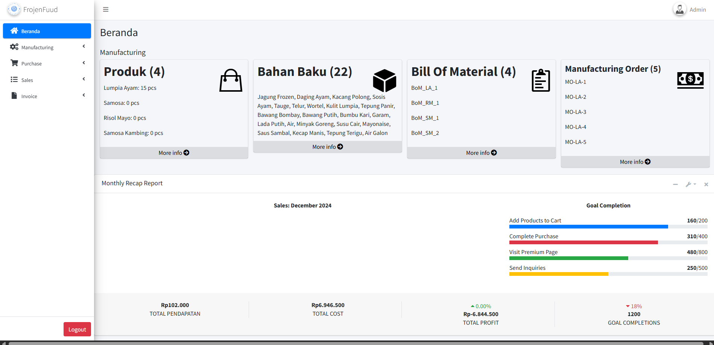

# FrojenFuud-ERP: Frozen Food Web ERP System

This project is a web-based **ERP system** designed for managing a frozen food business, named **FrojenFuud-ERP**. The system integrates multiple modules including **Manufacturing, Purchase, Sales, and Invoice**, providing a cohesive platform for managing inventory, orders, and financial documents in real-time.

---

## 🚀 Features
- Complete **ERP system** for frozen food business.  
- User authentication: secure **login system** for employees and managers.  
- **Manufacturing module**: creating products automatically reduces raw materials stock and increases finished products.  
- **Purchase module**: manage incoming stock and suppliers.  
- **Sales module**: record sales orders and update inventory in real-time.  
- **Invoice module**: generate and **send invoices via email**.  
- Real-time stock updates across all modules.  
- **Export PDF** functionality for reports, invoices, and order summaries.  
- User-friendly web interface built with **Laravel** and **JavaScript**.  

---

## 🛠️ Tech Stack
- **Backend**: Laravel, PHP  
- **Frontend**: JavaScript, Blade Templates  
- **Database**: MySQL / PostgreSQL / SQLite  
- **Other Tools**: Bootstrap (UI), DOMPDF (PDF export), Email integration, ApexChart / C3 Chart for reporting  

---

## 📊 System Workflow
1. User logs into the system.  
2. In the **Manufacturing module**, creating a product reduces raw material stock and increases finished product stock automatically.  
3. In the **Purchase module**, incoming stock updates inventory.  
4. In the **Sales module**, sales orders update stock in real-time.  
5. In the **Invoice module**, invoices can be generated, exported to PDF, and sent via email.  
6. All modules synchronize data to ensure accurate inventory and reporting.  

---
